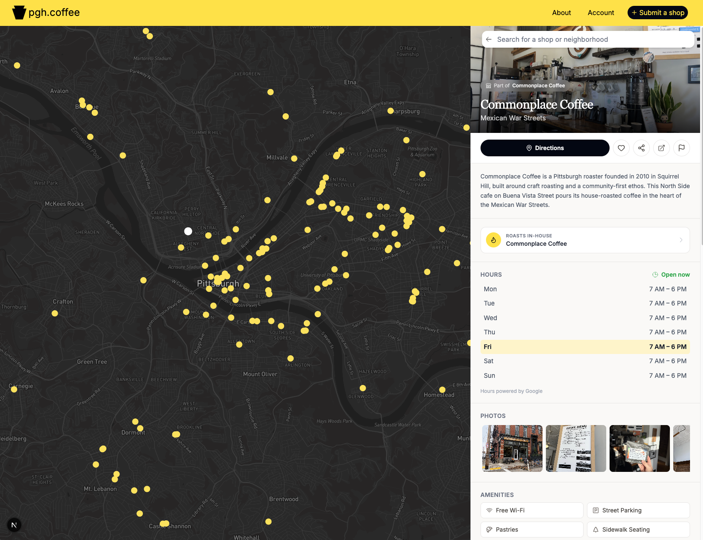

## Overview

<https://pgh.coffee/>



This repository contains the source code for pgh.coffee.
The website helps users to find coffee shops in Pittsburgh, PA.
The website uses Next.js for the application.
It uses Supabase for the PostgreSQL database.
It uses Zustand for state management and Tailwind CSS for styles.

## Contents
- [Overview](#overview)
- [Installation](#installation)
- [Tests](#tests)
- [API Documentation](#api-documentation)
- [License](#license)
- [Credits](#credits)

## Installation

1. **Clone the repository.**

```bash
git clone https://github.com/johngeorgeample/pgh-coffee.git
cd pgh-coffee
```

2. **Install the dependencies.**

```bash
npm install
```

3. **Get a Mapbox access token.**

- Go to [Mapbox](https://docs.mapbox.com/help/getting-started/access-tokens/).
- Create an access token. Select all the Public scopes.

4. **Make the environment file.**

- Copy `.env.example` to `.env`.
- Put your Mapbox access token in `MAPBOX_ACCESS_TOKEN`.
- Put your Supabase project URL in `NEXT_PUBLIC_SUPABASE_URL`.
- Put your Supabase anonymous key in `NEXT_PUBLIC_SUPABASE_ANON_KEY`.

5. **Start the development server.**

```bash
npm run dev
```

The application is available at <http://localhost:3000>.

## Tests

This project uses [Vitest](https://vitest.dev/) for the tests.
The `/tests/unit` directory contains the test files.

To run all the tests, do this:

```bash
npm test
```

## API Documentation

pgh.coffee gives a public API. Use the API to get data about the coffee shops in Pittsburgh.

For the endpoints and the response schemas, refer to [pgh.coffee/api-docs](https://pgh.coffee/api-docs).

## License

The MIT License applies to this project. For more data, refer to the LICENSE file.

## Credits

Thank you to the Pittsburgh coffee community for the support and the data.
